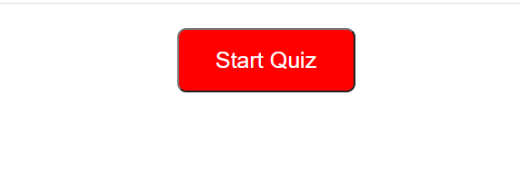
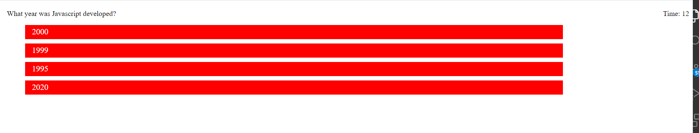

# JavaScriptMasteryQuiz

Tha Javascript mastery quiz is inteneded to gauge a students grasp of rudimentary javascript knowledge 
in a user friendly format.
Upon activating the start button the application admisinsters the quiz, tracks the user score and time to completion. User scores are saved into a leader board for comparison with peers. 

This is the start button:
 

The quiz interface looks like this:

Click (https://anav2096.github.io/JavaScriptMasteryQuiz/) to look at the quiz.

To see the repository Click (git@github.com:anav2096/JavaScriptMasteryQuiz.git)